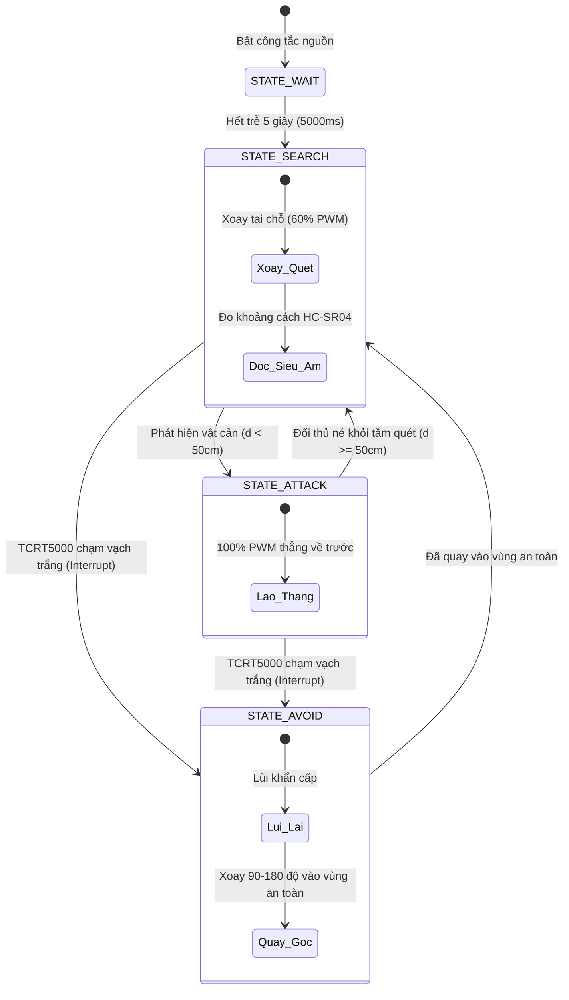

# 🤖 Autonomous Sumo Robot (Robot Sumo Tự Hành) - Nhóm 8

[](#)
[](#)
[](#)
[](#)
[](#)

> **Dự án thiết kế, chế tạo và lập trình Robot Sumo tự hành (Autonomous Sumo Robot) tham gia thi đấu đối kháng trên sàn đấu tiêu chuẩn (Dohyo).**  
> Dự án tích hợp liên ngành Cơ điện tử: **Thiết kế cơ khí 3D**, **Điện tử điều khiển**, và **Firmware thuật toán Máy trạng thái hữu hạn (FSM)**.

---

## 📑 Mục Lục

- [1. Giới Thiệu & Mục Tiêu](#1-giới-thiệu--mục-tiêu)
- [2. Thành Viên Thực Hiện (Nhóm 8)](#2-thành-viên-thực-hiện-nhóm-8)
- [3. Cấu Trúc Thư Mục Repository](#3-cấu-trúc-thư-mục-repository)
- [4. Thông Số Kỹ Thuật & Danh Mục Linh Kiện (BOM)](#4-thông-số-kỹ-thuật--danh-mục-linh-kiện-bom)
- [5. Thiết Kế Cơ Khí & Phần Cứng](#5-thiết-kế-cơ-khí--phần-cứng)
- [6. Thuật Toán Điều Khiển (Firmware & FSM)](#6-thuật-toán-điều-khiển-firmware--fsm)
- [7. Kết Quả Thực Nghiệm & Kiểm Thử](#7-kết-quả-thực-nghiệm--kiểm-thử)
- [8. Chiến Thuật Thi Đấu](#8-chiến-thuật-thi-đấu)
- [9. Hình Ảnh & Video Minh Họa](#9-hình-ảnh--video-minh-họa)
- [10. Đóng Góp & Hướng Phát Triển](#10-đóng-góp--hướng-phát-triển)

---

## 1. Giới Thiệu & Mục Tiêu

### 1.1. Bối cảnh & Luật thi đấu
Robot Sumo là thể thức thi đấu đối kháng giữa hai robot tự hành trong vòng tròn thi đấu (**Dohyo**):
- **Thể thức:** Đấu tối đa 3 hiệp (Best of 3), mỗi hiệp tối đa 3 phút.
- **Trễ 5 giây bắt buộc:** Khi trọng tài phát lệnh, bấm nút khởi động; robot phải đứng im đúng **5.000 ms** trước khi kích hoạt động cơ.
- **Điều kiện thắng:** Đẩy đối thủ chạm hoặc ra khỏi vạch trắng bao quanh võ đài, hoặc đối thủ tự rơi khỏi sàn.

### 1.2. Mục tiêu kỹ thuật
- **Tự động hóa hoàn toàn:** Nhận diện vị trí đối thủ bằng sóng siêu âm và phát hiện đường biên trắng bằng cảm biến quang hồng ngoại.
- **Tối ưu lực đẩy & độ bám:** Hạ thấp trọng tâm (COG), lưỡi ủi vát chéo 30°–45° nạo gầm đối phương, bánh xe silicon bám đường chống trượt.
- **Ổn định điện áp:** Cách ly mạch nguồn động lực và nguồn điều khiển, chống sụt áp gây reset vi điều khiển khi tăng ga đột ngột.

---

## 2. Thành Viên Thực Hiện (Nhóm 8)

| STT | Họ và Tên | MSSV / Vai trò | Nhiệm vụ chính | Đóng góp |
| :---: | :--- | :---: | :--- | :---: |
| **1** | **Bùi Phan Anh** | 25112006 | Thiết kế sơ đồ mạch, nối mạch, lắp ráp cơ điện tử, viết báo cáo | 100% |
| **2** | **Nguyễn Quang Thịnh** | Thành viên | Lập trình Firmware (FSM), nối mạch, lắp ráp | 100% |
| **3** | **Bùi Thế Anh** | Thành viên | Lắp ráp, nối mạch, chạy thực nghiệm và kiểm thử tính năng | 100% |
| **4** | **Lại Minh Vũ** | Thành viên | Dựng mô hình 3D vỏ / gá linh kiện, nối mạch, gia công lắp ráp | 100% |

---

## 3. Cấu Trúc Thư Mục Repository

```plaintext
robot-sumo/
│
├── image/                     # Thư mục chứa hình ảnh mô hình thực tế, mạch điện và khung vỏ
│   ├── 1.jpg                  # Bản vẽ thiết kế CAD 3D / Mô hình tổng quan
│   ├── 2.jpg                  # Chi tiết khung gầm và cụm lưỡi ủi
│   ├── 3.jpg                  # Bố trí động cơ và cảm biến dưới gầm
│   ├── 4.jpg                  # Bo mạch điều khiển và đi dây phần cứng
│   ├── 5.jpg                  # Lắp ráp hoàn thiện robot thực tế
│   └── 6.jpg                  # Thử nghiệm trên sân đấu Dohyo
│
├── video sumo.mp4             # Video ghi lại quá trình vận hành, dò vạch và húc đối thủ thực tế
├── báo cáo.docx               # Báo cáo kỹ thuật chi tiết toàn bộ đồ án (~31.000 từ)
└── README.md                  # Tài liệu tổng quan dự án (Tài liệu này)
```

---

## 4. Thông Số Kỹ Thuật & Danh Mục Linh Kiện (BOM)

### 4.1. Danh mục linh kiện chính (Bill of Materials)

| STT | Tên Linh Kiện | Thông Số Kỹ Thuật | Số Lượng | Chức Năng |
|:---:|:---|:---|:---:|:---|
| **1** | **Arduino Uno R3** | Vi điều khiển ATmega328P, 16MHz, 5V Logic | 01 | Bộ xử lý trung tâm điều khiển toàn hệ thống |
| **2** | **Driver L298N** | Cầu H kép, dòng tải tối đa 2A/kênh, điều khiển PWM | 01 | Điều khiển tốc độ và hướng quay 2 động cơ DC |
| **3** | **Động cơ DC giảm tốc** | Điện áp hoạt động 6V – 9V, kèm bánh xe cao su mềm/silicon | 02 | Tạo cơ cấu truyền động và lực đẩy húc đối thủ |
| **4** | **Cảm biến HC-SR04** | Cảm biến siêu âm, cự ly đo 2 cm – 400 cm (hiệu dụng 45 cm) | 01 | Phát hiện và khóa mục tiêu đối thủ phía trước |
| **5** | **Cảm biến TCRT5000** | Cảm biến hồng ngoại thu-phát, khoảng cách đọc ~4 mm | 02 | Dò vạch biên trắng Dohyo đặt ở 2 góc gầm trước |
| **6** | **Pin LiPo 2S** | Điện áp định danh 7.4V (Max 8.4V), dung lượng ~2200mAh | 01 | Nguồn cấp công suất cao cho toàn hệ thống |
| **7** | **Tụ lọc nguồn** | Tụ hóa điện dung 1000 µF | 01 | Ổn định áp, chống sụt áp vi điều khiển khi đề-pa |
| **8** | **Khung gầm & Vỏ bảo vệ** | Nhựa PLA in 3D FDM + Tấm đế Mica 3–5 mm cắt Laser | 01 bộ | Khung vỏ bảo vệ, gắn kết linh kiện, lưỡi ủi |

### 4.2. Đặc tính vận hành thực nghiệm
- **Tốc độ tìm kiếm (60% PWM):** ~0.25 m/s (xoay mượt mà, cảm biến quét không sót góc).
- **Tốc độ tấn công (100% PWM):** ~0.55 m/s (tạo quán tính và xung lực húc lớn).
- **Lực đẩy cực đại (Pushing Force):** ~**4.5 N – 5.2 N** (đo bằng lực kế lò xo trên mặt sàn chuẩn).
- **Thời gian phản hồi khi chạm vạch biên:** ≤ **20 ms** (lập tức lùi và đổi hướng an toàn).

---

## 5. Thiết Kế Cơ Khí & Phần Cứng

### 5.1. Cơ cấu cơ khí & Khung vỏ
- **Lưỡi ủi (Front Scoop):** Được thiết kế vát góc **30° – 45°** sát mặt sàn Dohyo. Giúp luồn xuống gầm đối phương, nhấc bổng bánh trước của đối thủ để triệt tiêu ma sát bám đường của đối phương trước khi đẩy văng ra ngoài.
- **Hạ thấp trọng tâm (Low COG):** Pin LiPo 2S và 2 Động cơ DC (các linh kiện nặng nhất) được đặt sát tấm đế gầm mica, giúp robot chống lật hiệu quả khi bị đâm từ bên hông.
- **Khoảng sáng gầm (Ground Clearance):** Tối ưu tiêu cự cho cảm biến dò vạch hồng ngoại TCRT5000 cách sàn **4 mm** (tránh tình trạng chạm sát dưới 1mm gây "mù" phản xạ tia hồng ngoại).

### 5.2. Thiết kế mạch điện & Chống sụt áp
- **Tách đường nguồn:** Nguồn Pin 7.4V được đưa trực tiếp vào chân $V_{cc}$ của Driver L298N để cấp tải động cơ; cấp qua chân Vin/mạch hạ áp của Arduino.
- **Bộ đệm chống Reset:** Bổ sung tụ lọc **1000 µF** tại đầu vào cấp nguồn Arduino, ngăn triệt để hiện tượng vi điều khiển bị sụt áp đột ngột dẫn đến khởi động lại khi động cơ tăng tốc (vấn đề thường gặp ở các phiên bản thử nghiệm ban đầu).

---

## 6. Thuật Toán Điều Khiển (Firmware & FSM)

Hệ thống được tổ chức theo kiến trúc **Máy Trạng Thái Hữu Hạn (Finite State Machine - FSM)** với 4 trạng thái cốt lõi:



### Chi tiết các trạng thái:
1. **`STATE_WAIT` (Trạng thái Chờ):**  
   Đứng yên đúng 5 giây (5000 ms) theo đúng điều lệ trọng tài, sau đó tự chuyển sang tìm kiếm.
2. **`STATE_SEARCH` (Trạng thái Tìm kiếm):**  
   Hai động cơ quay ngược chiều ở 60% xung PWM để robot xoay tròn quét 360°. Dữ liệu cảm biến siêu âm được lọc nhiễu qua thuật toán trung bình cộng 3 mẫu liên tiếp.
3. **`STATE_ATTACK` (Trạng thái Tấn công):**  
   Khi cự ly đo được $d < 50\text{ cm}$, robot khóa mục tiêu và tăng tốc 100% PWM lao thẳng húc đối thủ.
4. **`STATE_AVOID` (Trạng thái Tránh biên - Ưu tiên cao nhất):**  
   Khi bất kỳ cảm biến TCRT5000 nào báo vạch trắng:
   - Cảm biến Trái thấy vạch: Lùi lại $\rightarrow$ Xoay mạnh sang Phải.
   - Cảm biến Phải thấy vạch: Lùi lại $\rightarrow$ Xoay mạnh sang Trái.
   - Cả 2 cùng chạm: Lùi nhanh hết tốc lực $\rightarrow$ Xoay 180° thoát hiểm.

---

## 7. Kết Quả Thực Nghiệm & Kiểm Thử

Độ tin cậy của robot được xác nhận qua bộ kịch bản kiểm thử (Test Cases):

| Mã TC | Kịch Bản Kiểm Thử | Quy Trình Thực Hiện | Kết Quả Mong Đợi | Kết Quả Thực Tế | Đánh Giá |
|:---:|:---|:---|:---|:---|:---:|
| **TC-01** | **Kiểm tra luật trễ 5s** | Bấm nút khởi động, dùng đồng hồ bấm giờ chuẩn | Đứng yên đúng 5 giây, chỉ di chuyển sau 5s | Robot phản ứng chính xác sau 5000 ms | **ĐẠT** |
| **TC-02** | **Tính năng tránh biên** | Cho robot chạy thẳng về phía vạch trắng của võ đài | Dừng ngay lập tức, lùi lại và xoay góc an toàn | Nhận diện cực nhạy (phản hồi ≤ 20ms) | **ĐẠT** |
| **TC-03** | **Phát hiện & Khóa đối thủ** | Đặt vật cản cự ly 10 – 40 cm phía trước | Khóa mục tiêu, chuyển STATE_ATTACK đẩy tới | Lao thẳng với 100% công suất động cơ | **ĐẠT** |
| **TC-04** | **Lọc nhiễu cảm biến** | Thử nghiệm dưới nhiều điều kiện ánh sáng và góc quét | Không bị đổi trạng thái sai lệch | Thuật toán lọc trung bình hoạt động ổn định | **ĐẠT** |

---

## 8. Chiến Thuật Thi Đấu

1. **Khắc chế đối thủ tốc độ:**  
   Sau khi hết 5 giây trễ, robot có thể lùi nhẹ 1 nhịp hoặc lách nghiêng 45° né đòn lao phủ đầu của đối thủ cơ động, khiến đối phương húc trượt ra biên, sau đó tấn công từ mạn sườn.
2. **Khắc chế đối thủ hạng nặng:**  
   Tránh đối đầu trực diện lực đẩy; duy trì trạng thái rê vòng (`STATE_SEARCH`) để tìm kiếm góc sườn hoặc phía sau lưng đối thủ rồi mới phóng 100% PWM.
3. **Thoát hiểm đảo ngược thế trận khi bị ép:**  
   Khi bị đối thủ dồn về vạch biên, cảm biến chạm line kích hoạt chế độ hãm 1 bên bánh và kéo hết công suất bánh còn lại, xoay ngoắt 180° mượn lực đẩy của chính đối thủ để hoán đổi vị trí đẩy ngược họ ra đài.

---

## 9. Hình Ảnh & Video Minh Họa

Toàn bộ tư liệu dự án được lưu trữ trực tiếp trong repository:
- **Ảnh 3D & Thực tế:** Xem trong thư mục [`image/`](./image) (`1.jpg` – `6.jpg`).
- **Video Thực Nghiệm:** File video [`video sumo.mp4`](./video%20sumo.mp4) minh họa trực quan quá trình robot nhận diện và đẩy đối thủ trên sân.
- **Bản Báo Cáo Kỹ Thuật Đầy Đủ:** Xem file [`báo cáo.docx`](./báo%20cáo.docx).

---

## 10. Đóng Góp & Hướng Phát Triển

### Bài học kinh nghiệm
- **Tích hợp cơ khí - cảm biến:** Cần tính toán chính xác tiêu cự quang học của TCRT5000 ngay từ bản vẽ CAD thay vì điều chỉnh thủ công sau khi in 3D.
- **Quản lý nguồn điện:** Động cơ DC có dòng khởi động lớn dễ gây sụt áp vi điều khiển; bắt buộc phải có tụ đệm và cách ly đường nguồn.
- **Máy trạng thái (FSM):** Giúp firmware dễ debug, không bị xung đột lệnh di chuyển giữa dò biên và bắt đối thủ.

### Hướng cải tiến tương lai
- [ ] Bổ sung thêm 2 cảm biến khoảng cách hai bên sườn (hoặc dùng cảm biến Laser ToF) để triệt tiêu hoàn toàn góc mù phía sau và bên hông.
- [ ] Thiết kế bo mạch in nguyên khối (Custom PCB) thay cho dây nối testboard để tăng độ bền cơ học khi va đập mạnh.
- [ ] Cắt CNC tấm ủi bằng hợp kim nhôm / sợi carbon để chống mòn lưỡi ủi.
- [ ] Tích hợp thuật toán điều khiển PID để cân bằng tốc độ động cơ khi di chuyển trên các bề mặt sàn có độ ma sát không đồng đều.

---
*Dự án được hoàn thành bởi **Nhóm 8** - Bộ môn Cơ điện tử & Tự động hóa.*
